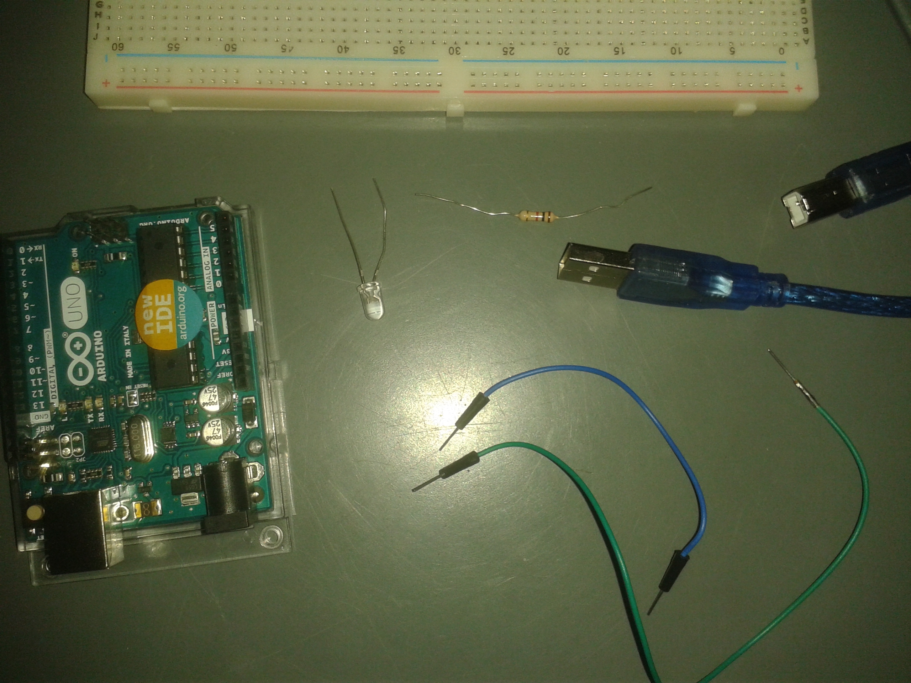
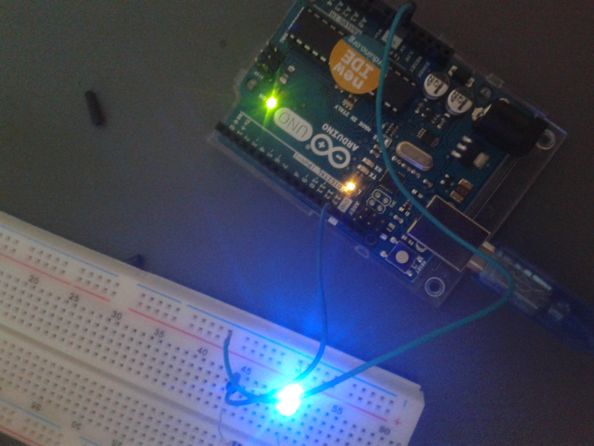

# Pierwsze kroki

*Ten samouczek opisuje jak zacząć zabawę z platformą Arduino bez żadnego wcześniejszego doświadczenia. Nauczysz się dzięki niemu instalacji i obsługi środowiska do pisania programów a także zapoznasz się z podstawową strukturą programu.*

### Czego potrzebujesz?

Przede wszystkim zapału ;) Do rozpoczęcia zabawy z układami typu Arduino potrzebny jest też program Arduino IDE. Jeżeli korzystasz z własnego laptopa z systemem Windows, program możesz zainstalować ze strony producenta. Na przygotowanych komputerach środowisko powinno znajdować się na pulpicie.

Jeżeli chodzi o sprzęt, przygotuj płytkę stykową, dowolny moduł Arduino, odpowiedni kabel (USB-B lub microUSB), kilka kabelków prototypowych, diodę LED oraz rezystor.



### Pierwszy układ - migacz

Migacz to najprostszy program, na którym można sprawdzać działanie sprzętu. Jest prosty, szybki, łatwy, a pozwala zapoznać się z podstawami jak i testować poprawność działania płytki, elementów i środowiska programistycznego. Jest to też domyślny program wgrany na fabryczne płytki Arduino.

Aby zobaczyć działanie programu, należy zmontować układ jak na rysunku poniżej. Płytka stykowa posiada w środku szyny, które łączą wszystkie elementy w jednej pionowej linii. W ten sposób można szybko budować rozgałęziające się obwody bez potrzeby lutowania czy innych łączników, co okaże się bardzo przydatne w ciągu następnych kursów ;)



Budując układ należy zwrócić uwagę na długość nóżek diody LED. Dioda przepuszcza prąd tylko w jedną stronę, dłuższa nóżka powinna być podłączona do plusa.

Rezystor włączony jest układu dla bezpieczeństwa. Jest to element wprowadzający opór do obwodu. Jeżeli zbudujemy obwód bez oporu i podłączymy go do prądu, prąd będzie bardzo duży i może zepsuć zarówno elementy, jak i samą płytkę. Jest to też powód dla którego nigdy nie powinno się łączyć dwóch złączy samym kablem.

### Program migacza

Uruchom program Arduino IDE. Pojawi się okno do wpisywania programu. Nasz pierwszy program będzie wyglądał następująco:

```c
void setup()
{
  pinMode(13,OUTPUT);
}
void loop()
{
  digitalWrite(13,HIGH);
  delay(1000);
  digitalWrite(13,LOW);
  delay(1000);
}
```

Program składa się z dwóch części, zwanych *funkcjami* (funkcji w programie jest więcej, ale tylko dwie z nich piszemy sami). Pierwsza linijka funkcji zawiera typ i jej nazwę - typami zajmiemy się potem. W programie na Arduino ważne są dwie funkcje: `setup` jest wywoływana na samym początku działania płytki i tylko raz. Żeby uruchomić ją ponownie, należy zresetować układ. `loop` natomiast jest wykonywane cały czas, najszybciej jak to tylko możliwe. Żeby układ migacza pracował w tempie postrzegalnym dla ludzkiego oka użyta jest funkcja `delay`, która czeka odpowiednią ilość tysięcznych sekund. Oznacza to, że `1000` w *argumentach* tej funkcji (zawartość nawiasu) powoduje odczekanie jednej sekundy.

Płytka Arduino zawiera zestaw wyjść zwanych *pinami*. W tym przykładzie korzystamy z pinu 13. Normalnie wszystkie ustawione są na wejście, oznacza to, że odczytują one sygnał, ale go nie wysyłają. Kiedy chcemy użyć jakiegoś urządzenia, takiego jak dioda, część pinów musi przyjąć stan wyjścia. Odpowiada za to funkcja `pinmode`. W jej argumentach podany jest numer pinu(który znajduje się na płytce) oraz *stała* `OUTPUT`. Stała ta to pewna wielkośc zdefiniowana przez program Arduino, której wartością nie musimy się przejmować - co jest ważne, to rola jaką odgrywa, w tym wypadku mówi ona funkcji, że ten pin będzie używany do wypluwania prądu.

Przełączanie sygnału odbywa się przy pomocy funkcji `digitalWrite`. Podobnie jak `pinMode` przyjmuje dwa argumenty, z czego pierwsza to numer pinu, a drugi to stała. W tym wypadku mamy dostępne dwie stałe: `HIGH` oznacza wysokie napięcie, czyli przepływ prądu, `LOW` oznacza napięcie niskie, czyli brak prądu.

### Problemy techniczne

Nie zawsze wszystko uda się uruchomić za pierwszym razem. Jeżeli natrafisz na problemy, zawsze warto zwrócić uwagę na kilka rzeczy:

1. Sprawdź, czy program jest napisany poprawnie. Sprawdź, czy nie zjadłeś któregoś ze znaków interpunkcyjnych lub nie popełniłeś literówki - są to jedne z najczęstszych pomyłek, także zaawansowanych programistów.
2. Upewnij się, że środowisko jest odpowiednio ustawione: w pasku narzędzia możesz wybrać model płytki - musi zgadzać się z modelem, z którego korzystasz. Warto też rzucić okiem na zakładkę port w narzędziach - powinna zawierać `ttyACM` (lub `COM` w przypadku Windowsa)
3. Jeżeli korzystasz z Linuxa, port może być zablokowany. W takim wypadku musisz otworzyć terminal(ikona na pasku zadań) i wpisać następującą komendę: `sudo chmod 777 /dev/ttyACM0`. Zamiast zera może być inna liczba - komputer automatycznie ją przydziela. Możesz zobaczyć wszystkie urządzenia w komputerze poleceniem `ls /dev`
